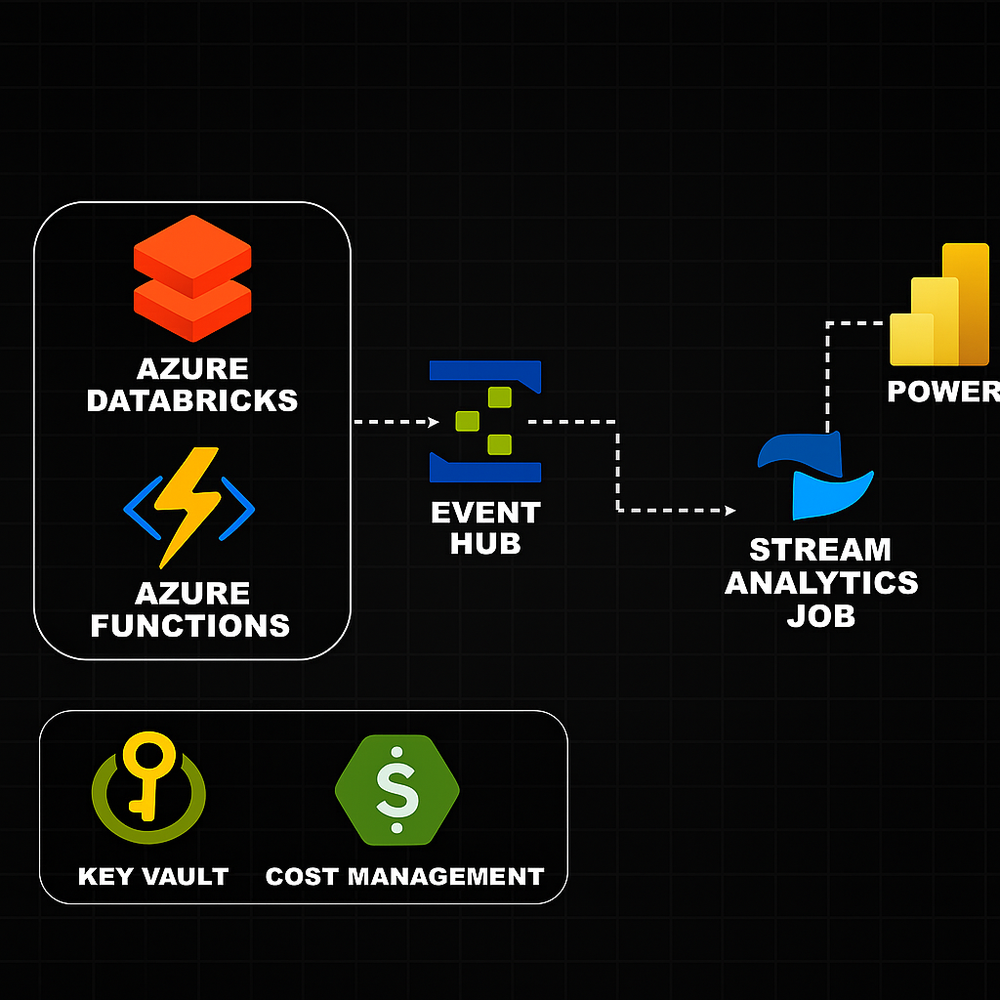
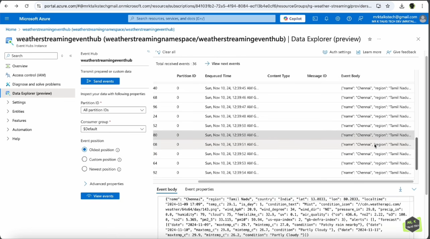
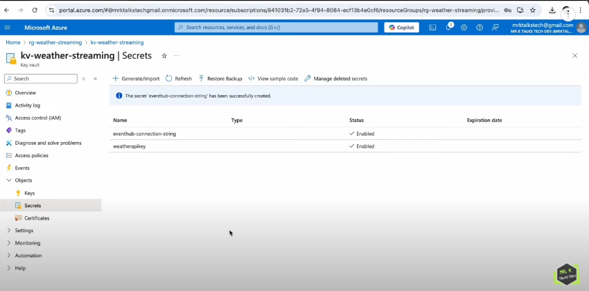
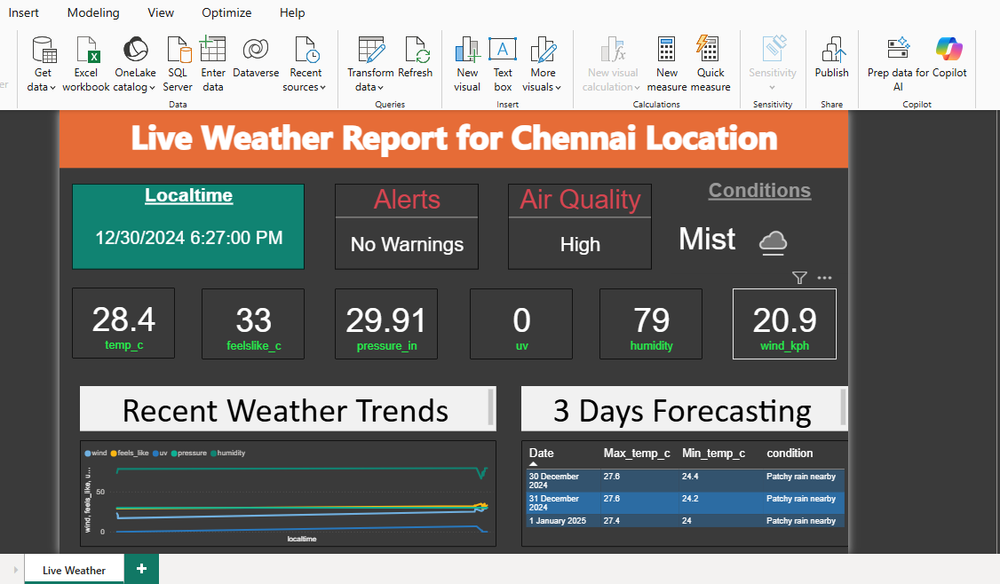
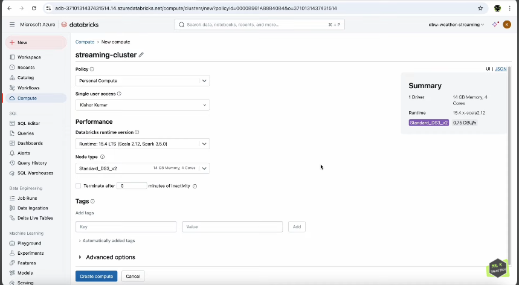
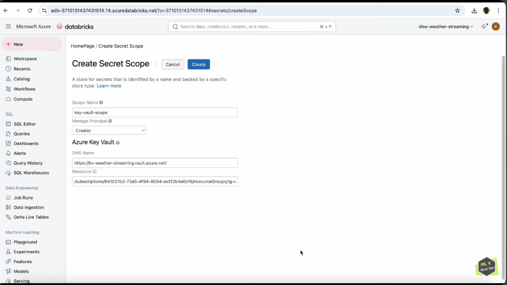
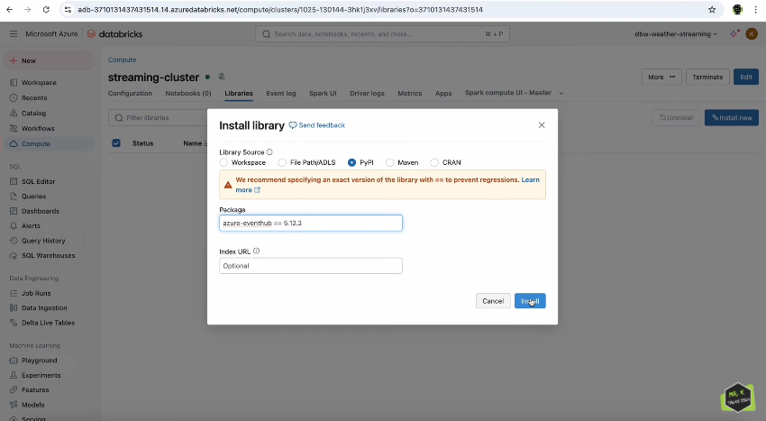

# Real-Time Weather Data Streaming Pipeline

## 🌦️ Project Overview

This project demonstrates a comprehensive **real-time weather data streaming pipeline** using Azure cloud services. The system ingests weather data from external APIs, processes it through Azure Event Hubs, and visualizes real-time insights through Power BI dashboards. The project showcases cost optimization strategies by providing both Databricks and Azure Functions implementations.



## 🏗️ Architecture

The solution implements a modern data streaming architecture with the following components:

### Data Sources
- **Weather API**: External weather service providing current weather, forecasts, and air quality data
- **Data Coverage**: Current conditions, 3-day forecasts, weather alerts, and air quality metrics

### Data Ingestion Layer
- **Azure Databricks**: PySpark-based streaming solution for scalable data processing
- **Azure Functions**: Cost-effective serverless alternative for lightweight data ingestion
- **Scheduling**: Automated data collection every 30 seconds

### Streaming Infrastructure
- **Azure Event Hubs**: Message broker for real-time data streaming
- **Azure Stream Analytics**: Stream processing and data transformation
- **Event-driven Architecture**: Ensures scalable and reliable data flow


*Event Hub setup and configuration for real-time data streaming*

### Security & Configuration
- **Azure Key Vault**: Centralized secret management for API keys and connection strings
- **Managed Identity**: Secure, passwordless authentication
- **Secret Scope Integration**: Seamless secret retrieval in Databricks


*Azure Key Vault configuration showing secure secret storage*

### Visualization
- **Power BI**: Real-time dashboard with live weather metrics
- **Automated Refresh**: Continuous data updates for current insights


*Real-time weather dashboard showing live metrics and visualizations*

## 🛠️ Technologies Used

### Cloud Services
- **Azure Event Hubs** - Message streaming platform
- **Azure Functions** - Serverless compute
- **Azure Databricks** - Analytics platform
- **Azure Stream Analytics** - Real-time analytics
- **Azure Key Vault** - Secret management
- **Power BI** - Business intelligence and visualization

### Programming & Frameworks
- **Python** - Primary programming language
- **PySpark** - Distributed data processing
- **Azure SDK** - Cloud service integration
- **Apache Spark Structured Streaming** - Real-time data processing

### APIs & Data Sources
- **WeatherAPI** - External weather data provider
- **REST APIs** - Data retrieval protocols

## 📁 Project Structure

```
Eventshub-fabric Project/
├── functions/                              # Azure Functions implementations
│   ├── FunctionsApp.py                     # Main Azure Functions application
│   └── weatherstreamingnotebook.py         # Alternative implementation
├── databricks/                             # Databricks notebooks and configurations
│   └── Weather-Streaming-Notebook.ipynb    # Main Databricks streaming notebook
├── dashboards/                             # Power BI dashboards and reports
│   └── Weatherreport.pbix                  # Weather streaming dashboard
├── images/                                 # Project screenshots and diagrams
│   ├── project_architecture.png            # Overall system architecture
│   ├── cluster_setup.png                   # Databricks cluster configuration
│   ├── databricks_keyvault_link.png        # Key Vault integration setup
│   ├── eventhub_library_installation.png   # EventHub library setup
│   ├── eventshub.png                       # Event Hub configuration
│   ├── key_vault_secrets.png               # Key Vault secrets management
│   └── power_BI_dashboard.png              # Dashboard visualization examples
└── README.md                              # This documentation
```

## 🚀 Key Features

### Dual Implementation Strategy
- **Databricks Solution**: High-performance streaming for large-scale scenarios
- **Azure Functions**: Cost-optimized serverless solution for moderate workloads
- **Cost Management**: Flexible deployment options based on requirements

### Comprehensive Weather Data
- **Current Conditions**: Temperature, humidity, wind speed, pressure
- **Air Quality**: PM2.5, PM10, CO, NO2, O3, SO2 levels
- **Weather Alerts**: Emergency weather notifications
- **Forecasting**: 3-day weather predictions

### Security Best Practices
- **Zero Hardcoded Secrets**: All sensitive data stored in Azure Key Vault
- **Managed Identity**: Passwordless authentication mechanism
- **Least Privilege Access**: Role-based access control implementation

### Real-time Processing
- **Event-driven Architecture**: Immediate data processing upon arrival
- **Scalable Streaming**: Handle varying data loads efficiently
- **Fault Tolerance**: Robust error handling and recovery mechanisms

## 📊 Data Flow

1. **Data Collection**: Weather API provides current conditions, forecasts, and alerts
2. **Data Processing**: Python functions flatten and structure the JSON responses
3. **Secure Access**: API keys and connection strings retrieved from Key Vault
4. **Event Publishing**: Processed data sent to Azure Event Hubs
5. **Stream Processing**: Azure Stream Analytics transforms and routes data
6. **Visualization**: Power BI dashboard displays real-time weather insights

## 🔧 Implementation Details

### Azure Functions Implementation
- **Timer Trigger**: Executes every 30 seconds (see `/functions/FunctionsApp.py`)
- **Event Hub Integration**: Uses Azure SDK for Python
- **Managed Identity**: Secure cloud resource access
- **Error Handling**: Comprehensive exception management

### Databricks Implementation
- **Spark Structured Streaming**: Real-time data processing (see `/databricks/Weather-Streaming-Notebook.ipynb`)
- **Secret Scope**: Secure Key Vault integration
- **Batch Processing**: Efficient data transformation
- **Auto-scaling**: Dynamic resource allocation


*Databricks cluster configuration for optimal performance*

### Data Transformation
- **JSON Flattening**: Complex nested structures converted to tabular format
- **Data Enrichment**: Additional metadata and timestamp information
- **Schema Validation**: Ensures data quality and consistency

## 💰 Cost Optimization Strategy

This project demonstrates effective cloud cost management through:

### Architectural Flexibility
- **Multiple Implementation Options**: Choose based on scale and budget
- **Serverless Computing**: Pay-per-execution model with Azure Functions
- **Resource Scaling**: Databricks clusters scale based on demand

### Cost Comparison
- **Azure Functions**: Ideal for development and moderate production workloads
- **Databricks**: Suitable for high-volume enterprise scenarios
- **Hybrid Approach**: Mix implementations based on specific requirements

## 🔐 Security Features

### Secret Management
```python
# Azure Key Vault integration example
def get_secret_from_keyvault(vault_url, secret_name):
    credential = DefaultAzureCredential()
    secret_client = SecretClient(vault_url=vault_url, credential=credential)
    retrieved_secret = secret_client.get_secret(secret_name)
    return retrieved_secret.value
```

### Managed Identity Authentication
- **No Password Management**: Eliminates credential storage concerns
- **Automatic Token Rotation**: Enhanced security through token lifecycle management
- **Cross-Service Authentication**: Seamless service-to-service communication


*Databricks secret scope configuration linking to Azure Key Vault*

## 📈 Monitoring & Observability

### Built-in Monitoring
- **Azure Functions Logs**: Detailed execution tracking
- **Event Hubs Metrics**: Throughput and latency monitoring
- **Power BI Usage Analytics**: Dashboard performance insights

### Error Handling
- **Retry Logic**: Automatic retry for transient failures
- **Dead Letter Queues**: Failed message handling
- **Comprehensive Logging**: Detailed error tracking and debugging

## 🎯 Use Cases

### Business Applications
- **Weather Monitoring**: Real-time weather tracking for operations
- **Agricultural Planning**: Farming decisions based on weather forecasts
- **Event Management**: Outdoor event planning and risk assessment
- **Transportation**: Weather-aware logistics and route planning

### Technical Learning
- **Cloud Architecture**: Understanding modern streaming architectures
- **Cost Optimization**: Comparing different Azure service options
- **Security Practices**: Implementing cloud security best practices
- **Real-time Analytics**: Building responsive data pipelines

## 🔧 Getting Started

### Prerequisites
- Azure subscription with appropriate permissions
- Power BI account for dashboard access
- WeatherAPI key for data access

### Deployment Steps
1. **Resource Provisioning**: Create Azure resources (Event Hubs, Key Vault, etc.)
2. **Secret Configuration**: Store API keys and connection strings in Key Vault
3. **Function Deployment**: Deploy Azure Functions or configure Databricks
4. **Dashboard Setup**: Import Power BI dashboard and configure data sources
5. **Testing**: Verify end-to-end data flow


*Installing required EventHub libraries in Databricks environment*

## 📋 Configuration

### Key Vault Secrets
- `weather-api-key`: WeatherAPI access key
- `event-hub-connection-string`: Event Hubs connection string
- Additional service-specific connection strings

### Environment Variables
- Event Hub namespace and name
- Key Vault URL
- Target locations for weather data collection

## 📸 Project Documentation

This project includes comprehensive visual documentation showcasing each component:

- **Architecture Overview**: Complete system design and data flow
- **Azure Resource Configuration**: Step-by-step setup screenshots
- **Security Implementation**: Key Vault and secret management setup
- **Real-time Dashboards**: Power BI visualization examples
- **Development Environment**: Databricks cluster and library configurations

All images are organized in the `/images` directory and provide visual proof of concept implementation.

## 🌟 Best Practices Demonstrated

### Cloud-Native Design
- **Microservices Architecture**: Loosely coupled service design
- **Event-Driven Processing**: Asynchronous, scalable data flow
- **Infrastructure as Code**: Reproducible deployment strategies

### Data Engineering
- **Schema Evolution**: Flexible data structure handling
- **Data Quality**: Validation and error handling mechanisms
- **Pipeline Monitoring**: Comprehensive observability implementation

### Security
- **Zero-Trust Model**: Verify every access request
- **Least Privilege**: Minimal required permissions
- **Secret Rotation**: Regular credential updates

## 🔄 Future Enhancements

### Technical Improvements
- **Machine Learning Integration**: Weather prediction models
- **Multi-Region Deployment**: Global data collection
- **Advanced Analytics**: Historical trend analysis
- **Mobile Applications**: Real-time weather notifications

### Operational Enhancements
- **Automated Testing**: CI/CD pipeline integration
- **Disaster Recovery**: Multi-region failover capabilities
- **Performance Optimization**: Enhanced throughput and latency
- **Cost Analytics**: Detailed spending analysis and optimization

## 📞 Contact & Support

This project demonstrates practical cloud engineering skills with a focus on:
- **Real-time Data Processing**
- **Cost-Effective Architecture Design**
- **Security Best Practices**
- **Scalable Cloud Solutions**

For questions about implementation details or architectural decisions, please refer to the code comments and documentation within each component.

---

*This project showcases modern cloud data engineering practices with emphasis on cost optimization, security, and scalability.*
